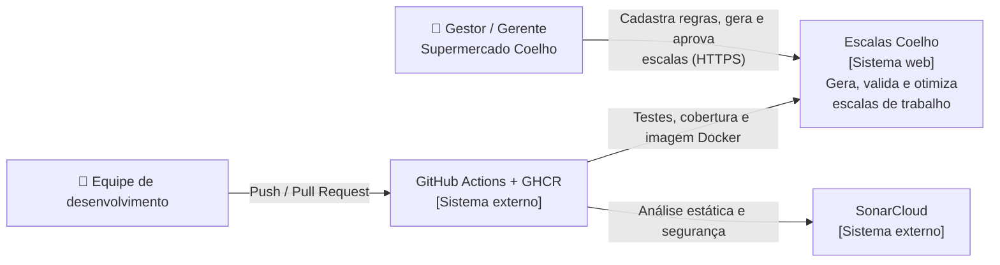
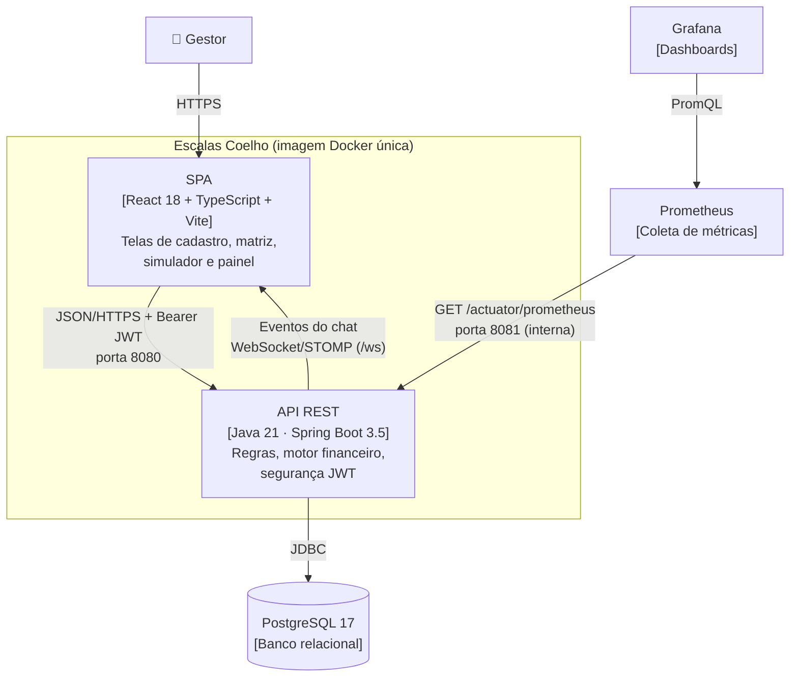
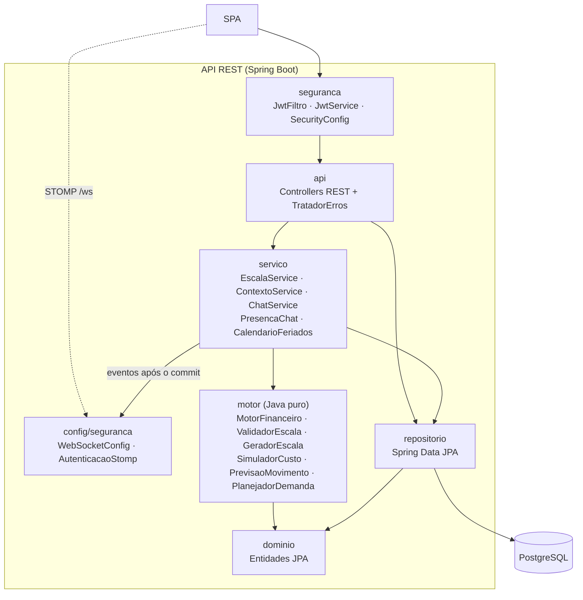

# Arquitetura — modelo C4

Diagramas em Mermaid (renderizados pelo GitHub).

## Nível 1 — Contexto

## Nível 2 — Contêineres

## Nível 3 — Componentes da API

## Decisões

| Decisão | Motivo |
|---------|--------|
| Arquitetura em camadas, com o **motor isolado** do Spring e do banco | O núcleo financeiro e trabalhista é testado com cenários em memória (`motor/*Test`), sem infraestrutura. |
| **SPA + API na mesma imagem** | Um único artefato para implantar e versionar; o Spring serve o build do Vite e encaminha as rotas da SPA (`SpaController`). |
| **JWT stateless** | Escala horizontal sem sessão no servidor; segredo fornecido pelo ambiente (`APP_JWT_SECRET`). |
| **PostgreSQL** em todos os ambientes, inclusive nos testes de integração | Mesmo dialeto em testes e produção; atende à exigência de persistência real. |
| **Porta de gerência separada (8081)** | Métricas e health check ficam fora da porta pública. |
| **Previsão explicável (estatística), não um modelo opaco** | Média ponderada recente do mesmo dia da semana + efeitos medidos no próprio histórico (início do mês, véspera de feriado), com a justificativa de cada número. Funciona com poucas semanas de dados, é testável com cenários exatos e o gestor entende e confia na previsão; sem histórico, vale a configuração manual. |
| **Demanda por faixa com escolha gulosa de turnos** | Pessoas por faixa = ⌈clientes ÷ (capacidade × horas)⌉; a cada passo, o modelo de turno que cobre mais faixas descobertas. Simples de explicar e próximo do ótimo para os poucos modelos de turno de uma loja. Abaixo do previsto é alerta (o gestor decide); abaixo do piso manual é erro. |
| **Chamadas de voz com WebRTC** | O áudio vai direto entre os navegadores; o servidor só controla o estado da chamada e repassa a sinalização (offer/answer/ICE) pelo mesmo WebSocket do chat. Credenciais TURN temporárias (HMAC), sem segredo no navegador. |
| **Chat: envio por REST, entrega por WebSocket** | As mensagens passam pela mesma validação, autorização e testes da API; o WebSocket (STOMP) só entrega eventos, e apenas após o commit. O broker é em memória: para mais de uma instância da aplicação, trocar por um broker externo (ex.: RabbitMQ). |
